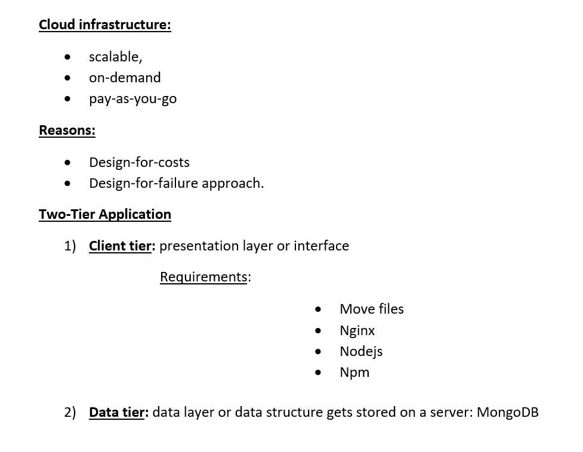

# Cloud computing with AWS

## What is cloud computing?

Cloud computing is the on-demand delivery of IT resources over the Internet with pay-as-you-go pricing. Instead of buying, owning, and maintaining physical data centers and servers, you can access technology services, such as computing power, storage, and databases, on an as-needed basis from a cloud provider like Amazon Web Services (AWS).

Cloud computing is a network of servers connected using the Internet. Its main function is to share information, resources, and software. The Internet acts as the invisible cable that connects everything. This includes all physical and virtual servers all over the globe.

Simply put, cloud computing is the delivery of computing services—including servers, storage, databases, networking, software, analytics, and intelligence—over the Internet (“the cloud”) to offer faster innovation, flexible resources, and economies of scale.

Cloud computing is the on-demand availability of computer system resources, especially data storage and computing power, without direct active management by the user. Large clouds often have functions distributed over multiple locations, each location being a data center.

## Who is using cloud computing?

Organizations of every type, size, and industry are using the cloud for a wide variety of use cases, such as data backup, disaster recovery, email, virtual desktops, software development and testing, big data analytics, and customer-facing web applications. For example, healthcare companies are using the cloud to develop more personalized treatments for patients. Financial services companies are using the cloud to power real-time fraud detection and prevention. And video game makers are using the cloud to deliver online games to millions of players around the world.

## Benefits of cloud computing

### Agility

The cloud gives you easy access to a broad range of technologies so that you can innovate faster and build nearly anything that you can imagine. You can quickly spin up resources as you need them–from infrastructure services, such as compute, storage, and databases, to Internet of Things, machine learning, data lakes and analytics, and much more.

You can deploy technology services in a matter of minutes, and get from idea to implementation several orders of magnitude faster than before. This gives you the freedom to experiment, test new ideas to differentiate customer experiences, and transform your business.

### Elasticity

With cloud computing, you don’t have to over-provision resources up front to handle peak levels of business activity in the future. Instead, you provision the amount of resources that you actually need. You can scale these resources up or down to instantly grow and shrink capacity as your business needs change.

### Cost savings

The cloud allows you to trade fixed expenses (such as data centers and physical servers) for variable expenses, and only pay for IT as you consume it. Plus, the variable expenses are much lower than what you would pay to do it yourself because of the economies of scale. 

### Deploy globally in minutes

With the cloud, you can expand to new geographic regions and deploy globally in minutes. For example, AWS has infrastructure all over the world, so you can deploy your application in multiple physical locations with just a few clicks. Putting applications in closer proximity to end users reduces latency and improves their experience. 

## Types of cloud computing

Cloud computing is providing developers and IT departments with the ability to focus on what matters most and avoid undifferentiated work like procurement, maintenance, and capacity planning. As cloud computing has grown in popularity, several different models and deployment strategies have emerged to help meet specific needs of different users. Each type of cloud service, and deployment method, provides you with different levels of control, flexibility, and management. Understanding the differences between Infrastructure as a Service, Platform as a Service, and Software as a Service, as well as what deployment strategies you can use, can help you decide what set of services is right for your needs.

## Cloud Computing Models

There are three main models for cloud computing. Each model represents a different part of the cloud computing stack.

### Infrastructure as a Service (IaaS)

Infrastructure as a Service, sometimes abbreviated as IaaS, contains the basic building blocks for cloud IT and typically provide access to networking features, computers (virtual or on dedicated hardware), and data storage space. Infrastructure as a Service provides you with the highest level of flexibility and management control over your IT resources and is most similar to existing IT resources that many IT departments and developers are familiar with today.

### Platform as a Service (PaaS)
Platforms as a service remove the need for organizations to manage the underlying infrastructure (usually hardware and operating systems) and allow you to focus on the deployment and management of your applications. This helps you be more efficient as you don’t need to worry about resource procurement, capacity planning, software maintenance, patching, or any of the other undifferentiated heavy lifting involved in running your application.

### Software as a Service (SaaS)

Software as a Service provides you with a completed product that is run and managed by the service provider. In most cases, people referring to Software as a Service are referring to end-user applications. With a SaaS offering you do not have to think about how the service is maintained or how the underlying infrastructure is managed; you only need to think about how you will use that particular piece of software. A common example of a SaaS application is web-based email where you can send and receive email without having to manage feature additions to the email product or maintaining the servers and operating systems that the email program is running on.

## Cloud Computing Deployment Models

### Cloud

A cloud-based application is fully deployed in the cloud and all parts of the application run in the cloud. Applications in the cloud have either been created in the cloud or have been migrated from an existing infrastructure to take advantage of the benefits of cloud computing. Cloud-based applications can be built on low-level infrastructure pieces or can use higher level services that provide abstraction from the management, architecting, and scaling requirements of core infrastructure.

### Hybrid

A hybrid deployment is a way to connect infrastructure and applications between cloud-based resources and existing resources that are not located in the cloud. The most common method of hybrid deployment is between the cloud and existing on-premises infrastructure to extend, and grow, an organization's infrastructure into the cloud while connecting cloud resources to internal system. For more information on how AWS can help you with your hybrid deployment, please visit our hybrid page.

### On-premises

Deploying resources on-premises, using virtualization and resource management tools, is sometimes called “private cloud”. On-premises deployment does not provide many of the benefits of cloud computing but is sometimes sought for its ability to provide dedicated resources. In most cases this deployment model is the same as legacy IT infrastructure while using application management and virtualization technologies to try and increase resource utilization.

### Examples

Pay as you go: cost effectiveness
Capex, opex: capital and operational expenditure
- A seasonal business will need flexibility to scale the use of resources as needed. When the business needs less resources it can scale back and save money on IT costs.

### AWS Global Infrastructure Map

- Normally, a company will use 3 availability zones.
- Example: Sparta Global uses London for computing resources, Ireland for databases and Frankfurt for networks.

### Cloud Models

- Public
- Private
- Hybrid

Example: the bank industry usually uses the hybrid model because they deal with highly sensitive information and they prefer to mantain control of these data. For other information that needs to have high availability they will use public services.

- Naming convention for the files that I create: eng110_sergio
- Instances should be turned off/terminated every day before 6pm (exceptionally 8pm maximum)
- Only use the Ireland region: eu-west-1/a/b/c
- AWS keys must not be shared with anyone.
- eng119.pem: move to .ssh folder in my machine

### Use of cloud services

- We have a monolith application available on premises/localhost/local data centre, that we want to deploy on cloud services.
- We create an VM instance, called EC2 in Amazon web services
- We need to SSH into the VM. For that we need a file.pem (chmod 400)
- We store the file in a .ssh folder (it is a private key)
- By default the ssh port is 22
- We have to create a security group to allow the required ports for some applications that run on especified ports (80 - 3000 for example)

### Cloud terminology

- storage: volume - EBS
- firewall: security group
- memory
- processing power

The client will give us the especifications according to 3 constrains:
- cost
- time
- power

### Steps to create a VM on AWS

- Create new EC2 instance on Ireland availability zone
- Step 1: Choose an Amazon Machine Image (AMI)
- Step 2: Choose the Ubuntu Server 18.04 LTS (HVM), SSD Volume Type Instance
- Select: Type t2.micro
- Step 3: Select: `Next: Configure Instance Details`
          Enable: `Auto-assign Public IP`
- Step 4: Add storage
- Step 5: Add tags: `Key: Name, Value: eng110_sergio`
- Step 6: Configure security group name: `eng110_sergio_sg`, description: `eng110_sergio_sg`
- Select: type: SSH, by default the port is 22, Source: MyIP
- We need to install nginx: Add rule `HTTP`, Port range: 80, Source: anywhere
- Finally: click on Review and Launch
- Select an existing key pair: `Eng119`

### How to SSH into the VM

- Download the eng119.pem file and move it to our `.shh` folder
- Click on `Connect to instance`
- Click on `SSH client`
- Copy the SSH address: `ssh -i "eng119.pem" ubuntu@ec2-18-203-127-78.eu-west-1.compute.amazonaws.com`

### How to install nginx in our VM and access the nginx welcome web page

- sudo apt update/upgrade
- sudo apt install nginx
- Copy the VM Public IP address into my browser to access the nginx welcome page
- IP: `18.203.127.78`

# Steps to install the node.js app in the VM

# 1 

- Every day the IP address changes
- I need to reselect the IP for the security group to allow it (my ip)
- scp file.pem localhost/address destination/address

from root:
scp -i ~/.ssh/eng119.pem -r ~/Documents/app ubuntu@ec2-34-254-200-213.eu-west-1.compute.amazonaws.com:~/devops/app

rsaync also can be used
- enter new IP
- install nodejs with required dependencies

# 2
allow port 3000
cd app
npm install
nmp start

# 3
configure Nginx reverse proxy
access the app without adding port 3000

# 4
Configure Mongodb
spin up a new EC2 instance in eu-west-1 (Ireland)
create a security group to allow required ports 27017
port 22

export DB_HOST=mongodb://3.248.187.17:27017/posts

# Create 2 new instances and do everything again

1) create a EC2 instance

Auto-assign Public IP: `enable`

Security group SSH: add my IP
Add port 80, allow from anywhere

Custom TCP Rule: 27017  IP/32

2) Copy the app files into the VM

- clone the repository into the VM
- install nginx `sudo apt-get install nginx`
- install nodejs 

`sudo apt install software-properties-common -y 
curl -sL https://deb.nodesource.com/setup_12.x | sudo -E bash -
sudo apt-get install nodejs -y`

- install npm
- start npm
- the app should be available on port 3000

3) Create a new EC2 instance to install Mongodb on it

- Create a new security group for the new EC2 instance

- configure 2 rules: 

1- SSH, port 22, myIP
2- HTTP, PORT 27017: allow the EC2 with the app to connect with the db

    sudo apt-key adv --keyserver hkp://keyserver.ubuntu.com:80 --recv D68FA50FEA312927
    
    echo"deb https://repo.mongodb.org/apt/ubuntu xenial/mongodb-org/3.2 multiverse"| sudo tee /etc/apt/sources.list.d/mongodb-org-3.2.list
    
    sudo apt-get install -y mongodb-org=3.2.20 mongodb-org-server=3.2.20 mongodb-org-shell=3.2.20 mongodb-org-mongos=3.2.20 mongodb-org-tools=3.2.20

export DB_HOST=mongodb://34.242.3.202:27017/posts

node app.js

create env DB_HOST:mongodb://db-ip-add:27017/posts

cd /etc
sudo nano mongo.conf
config.sys: 
# network interfaces
bindIp: 0.0.0.0
change to 0.0.0.0

(check if the changes were saved)
cat mongo.conf

restart mongodb

sudo systemctl start mongod
sudo systemctl restart mongod
sudo systemctl enable mongod
sudo systemctl status mongod

if I need to stop the nginx process

ps aux
get the node id
sudo kill id=1282

# Amazon Machine Images (AMI)

## Building an AMI

/app
(put the ip from the data instance)
sudo echo "export DB_HOST=mongodb://54.75.82.219:27017/posts" >> ~/.bashrc
source ~/.bashrc
printenv DB_HOST

sre_jenkins_cicd
/environment/db

# Architecting on AWS: Building a Two-Tier Application

This is an example of architecting on AWS to build a common two-tier application deployment.

The notion of a scalable, on-demand, pay-as-you-go cloud infrastructure tends to be easily understood by the majority of today’s IT specialists. However, in order to fully reap the benefits from hosting solutions in the cloud, you will have to rethink traditional ‘on-premises’ design approaches. This should happen for a variety of reasons with the most prominent ones the design-for-costs or the adoption of a design-for-failure approach.

A two-tier architecture is a software architecture in which a presentation layer or interface runs on a client, and a data layer or data structure gets stored on a server. Separating these two components into different locations represents a two-tier architecture, as opposed to a single-tier architecture.

On the client application side the code is written for saving the data in the SQL server database. Client sends the request to the server and it processes the request & sends it back with data. The main problem of two tier architecture is the server cannot respond to multiple requests at the same time, as a result it causes a data integrity issue.

It’s also called server-client technology.

Advantages:

-Easy to maintain and modification is bit easy
-Communication is faster

Disadvantages:

-In two tier architecture application performance will be degraded as soon as the number of users increases.
-Cost-ineffective

## 1) Client Application (Client Tier)

I will create an EC2 instance and install nginx, which is an open-source web server that can also be used as a reverse proxy.
It's open source and free to use, so anyone can download and install the software and use it to host a website. 
The NGINX software has not been installed on your computer – it runs only on computers that are serving web pages.

I also need to move the files with the web application from my laptop into the EC2 instance. 
The Unix command scp (which stands for "secure copy protocol") is a simple tool for uploading or downloading files.

`scp -i ~/.ssh/eng119.pem -r ~/Downloads/app ubuntu@ec2-54-74-247-127.eu-west-1.compute.amazonaws.com:~`

SSH into the EC2 instance and install all the required dependencies:

- Check if I have internet access into the EC2 instance: `sudo apt-get update` `sudo apt-get upgrade`
- Nginx (web server): `sudo apt-get install nginx`
- Nodejs: 

`sudo apt install software-properties-common -y`
`curl -sL https://deb.nodesource.com/setup_12.x | sudo -E bash -`
`sudo apt-get install nodejs -y`

- Npm:

`sudo apt-get install npm`
`sudo apt-get start npm`

I have to add the security rules to allow the application to use port 3000 on the EC2 instance public ip.

I will also use Nginx as a reverse proxy: 

Within the server block you should have an existing location / block. 
Replace the contents of that block with the following configuration:

location / {
        proxy_pass http://localhost:3000; 
        proxy_http_version 1.1;
        proxy_set_header Upgrade $http_upgrade;
        proxy_set_header Connection 'upgrade';
        proxy_set_header Host $host;
        proxy_cache_bypass $http_upgrade;
}

I will an additional location block to the same server block to provide access to other applications on the same server.

location / fibonacci/:n {
        proxy_pass http://localhost:3000; 
        proxy_http_version 1.1;
        proxy_set_header Upgrade $http_upgrade;
        proxy_set_header Connection 'upgrade';
        proxy_set_header Host $host;
        proxy_cache_bypass $http_upgrade;
}

- Make sure I didn’t introduce any syntax errors by typing: `sudo nginx -t`

- Restart nginx `sudo systemctl restart nginx`

## 2) Database Tier (Data Tier)

### Create a new EC2 instance to install Mongodb on it

MongoDB is a general-purpose, NoSQL database that provides support for JSON-styled, document-oriented storage systems. Its flexible data model enables you to store data of any structure, and it provides full index support, sharding, and replication.

- Choose a different security group for the new EC2 instance

- configure 2 rules: 

1- SSH, port 22, myIP
2- HTTP, PORT 27017: allow the EC2 with the app to connect with the db: provide the ip of the EC2 of the client tier (with the node app)

### Install Mongodb:

sudo apt-key adv --keyserver hkp://keyserver.ubuntu.com:80 --recv D68FA50FEA312927
echo "deb https://repo.mongodb.org/apt/ubuntu xenial/mongodb-org/3.2 multiverse"| sudo tee /etc/apt/sources.list.d/mongodb-org-3.2.list

sudo apt-get update
sudo apt-get upgrade

sudo apt-get install -y mongodb-org=3.2.20 mongodb-org-server=3.2.20 mongodb-org-shell=3.2.20 mongodb-org-mongos=3.2.20 mongodb-org-tools=3.2.20

sudo apt install mongodb-org

cd /etc
sudo nano mongod.conf
config.sys: 

network interfaces:

-bindIp: 0.0.0.0 (allow anybody to connect with the database)

Check if the changes were saved:

cat mongod.conf

restart mongodb

`sudo systemctl start mongod`
`sudo systemctl restart mongod`
`sudo systemctl enable mongod`
`sudo systemctl status mongod`

### SSH in Client tier to create an env variable

- I have to SSH in the EC2 (client tier) to create an environment variable:

When we run a command, any settings that you specified with environment variables take precedence over the settings stored in the configuration file.

I will pass new settings to the configuration file to connect the client tier with the data tier.

To set an environment variable the `export` command is used. We give the variable a name, which is what is used to access it in the app.js configuration and then a value to hold the data that is needed in the variable, which is the ip of the data tier.

- Persisting Environment Variables for a User

When an environment variable is set from the shell using the export command, its existence ends when the user’s sessions ends. This is problematic when we need the variable to persist across sessions.

To make an environment persistent for a user’s environment, we export the variable from the user’s profile script.

Adding the environment variable to a user’s bash profile alone will not export it automatically. However, the variable will be exported the next time the user logs in.

In order to set a permanent environment variable in Bash, I have to use the export command and add it either to my “.bashrc” file

To immediately apply all changes to bash_profile for my current session, I will use the source command to source my .bashrc file.

create environment variable = DB_HOST
(put the ip from the data tier)

`sudo echo "export DB_HOST=mongodb://54.75.82.219:27017/posts" >> ~/.bashrc`

`source ~/.bashrc`

printenv DB_HOST

- if I need to stop the nginx process

ps aux
get the node id
sudo kill id=1282

# Features of Amazon S3

## Storage classes

Amazon S3 offers a range of storage classes designed for different use cases. For example, you can store mission-critical production data in S3 Standard for frequent access, save costs by storing infrequently accessed data in S3 Standard-IA or S3 One Zone-IA, and archive data at the lowest costs in S3 Glacier Instant Retrieval, S3 Glacier Flexible Retrieval, and S3 Glacier Deep Archive.

You can store data with changing or unknown access patterns in S3 Intelligent-Tiering, which optimizes storage costs by automatically moving your data between four access tiers when your access patterns change. These four access tiers include two low-latency access tiers optimized for frequent and infrequent access, and two opt-in archive access tiers designed for asynchronous access for rarely accessed data.

# How Amazon S3 works

Amazon S3 is an object storage service that stores data as objects within buckets. An object is a file and any metadata that describes the file. A bucket is a container for objects.

To store your data in Amazon S3, you first create a bucket and specify a bucket name and AWS Region. Then, you upload your data to that bucket as objects in Amazon S3. Each object has a key (or key name), which is the unique identifier for the object within the bucket.

S3 provides features that you can configure to support your specific use case. For example, you can use S3 Versioning to keep multiple versions of an object in the same bucket, which allows you to restore objects that are accidentally deleted or overwritten.

Buckets and the objects in them are private and can be accessed only if you explicitly grant access permissions. You can use bucket policies, AWS Identity and Access Management (IAM) policies, access control lists (ACLs), and S3 Access Points to manage access.

crud (create, read, update, delete)
aws cli (command line interface)
aws

s3 Bucket: single storage object: stores any kind of data
social media uses it – don’t care about the format of the data
flexibility – cost effective 

It is related to disaster recovery: can be used as a backup data

if I need to communicate with an S3 from an instance I will need a key

AWS secret and secret keys using AWSCLI (add to the diagram)

AWS is built using python

access key + secret key = I need to have both of them 

sudo pip3 install awscli
sudo python3 -m pip install awscli
 sudo apt install python3-pip -y
alias python=python3

AWS configure file
1-AWS access key
2- AWS secret key
3- format json
4- regions: eu-west-1

aws configure
aws s3 ls

aws s3 mb s3://eng

make bucket

aws s3 mb s3://eng110-sergio

# Accessing Amazon S3

## AWS Management Console

The console is a web-based user interface for managing Amazon S3 and AWS resources. If you've signed up for an AWS account, you can access the Amazon S3 console by signing into the AWS Management Console and choosing S3 from the AWS Management Console home page.

## AWS Command Line Interface

You can use the AWS command line tools to issue commands or build scripts at your system's command line to perform AWS (including S3) tasks.

## AWS SDKs

AWS provides SDKs (software development kits) that consist of libraries and sample code for various programming languages and platforms (Java, Python, Ruby, .NET, iOS, Android, and so on). The AWS SDKs provide a convenient way to create programmatic access to S3 and AWS. Amazon S3 is a REST service. You can send requests to Amazon S3 using the AWS SDK libraries. which wrap the underlying Amazon S3 REST API and simplify your programming tasks. For example, the SDKs take care of tasks such as calculating signatures, cryptographically signing requests, managing errors, and retrying requests automatically.

## Amazon S3 REST API

The architecture of Amazon S3 is designed to be programming language-neutral, using AWS-supported interfaces to store and retrieve objects. You can access S3 and AWS programmatically by using the Amazon S3 REST API. The REST API is an HTTP interface to Amazon S3. With the REST API, you use standard HTTP requests to create, fetch, and delete buckets and objects.

To use the REST API, you can use any toolkit that supports HTTP. You can even use a browser to fetch objects, as long as they are anonymously readable.

The REST API uses standard HTTP headers and status codes, so that standard browsers and toolkits work as expected. In some areas, we have added functionality to HTTP (for example, we added headers to support access control). In these cases, we have done our best to add the new functionality in a way that matches the style of standard HTTP usage.

If you make direct REST API calls in your application, you must write the code to compute the signature and add it to the request.

# Reading a Specific File from an S3 bucket Using Python

https://www.sqlservercentral.com/articles/reading-a-specific-file-from-an-s3-bucket-using-python

How can I connect to an AWS S3 bucket to read a specific file from a list of objects stored in S3?:

 We will then import the data in the file and convert the raw data into a Pandas data frame using Python for more deeper structured analysis.

# Solution

In this section we will look at how we can connect to AWS S3 using the boto3 library to access the objects stored in S3 buckets, read the data, rearrange the data in the desired format and write the cleaned data into the csv data format to import it as a file into Python Integrated Development Environment (IDE) for advanced data analytics use cases.

We can use any IDE, like Spyder or JupyterLab (of the Anaconda Distribution). Here we are using JupyterLab.

The first step would be to import the necessary packages into the IDE. Boto is the Amazon Web Services (AWS) SDK for Python.

Identify the bucket that you would like to access where you have your data stored. Once you have identified the name of the bucket for instance ‘filename_prod’, you can assign this name to the variable named s3_bucket name as shown in the script below:

"""Accessing the S3 buckets using boto3 client"""
s3_client =boto3.client('s3')
s3_bucket_name='filename_prod'
s3 = boto3.resource('s3',
                    aws_access_key_id= 'YOUR_ACCESS_KEY_ID',
                    aws_secret_access_key='YOUR_SECRET_ACCESS_KEY')

# s3 naming convention - bucket policies

Bucket naming rules

The following rules apply for naming buckets in Amazon S3:

Bucket names must be between 3 (min) and 63 (max) characters long.

Bucket names can consist only of lowercase letters, numbers, dots (.), and hyphens (-).

Bucket names must begin and end with a letter or number.

Bucket names must not be formatted as an IP address (for example, 192.168.5.4).

Bucket names must not start with the prefix xn--.

Bucket names must not end with the suffix -s3alias. This suffix is reserved for access point alias names. For more information, see Using a bucket-style alias for your access point.

Bucket names must be unique across all AWS accounts in all the AWS Regions within a partition. A partition is a grouping of Regions. AWS currently has three partitions: aws (Standard Regions), aws-cn (China Regions), and aws-us-gov (AWS GovCloud (US)).

A bucket name cannot be used by another AWS account in the same partition until the bucket is deleted.

Buckets used with Amazon S3 Transfer Acceleration can't have dots (.) in their names. For more information about Transfer Acceleration, see Configuring fast, secure file transfers using Amazon S3 Transfer Acceleration.

For best compatibility, we recommend that you avoid using dots (.) in bucket names, except for buckets that are used only for static website hosting. If you include dots in a bucket's name, you can't use virtual-host-style addressing over HTTPS, unless you perform your own certificate validation. This is because the security certificates used for virtual hosting of buckets don't work for buckets with dots in their names.

This limitation doesn't affect buckets used for static website hosting, because static website hosting is only available over HTTP. For more information about virtual-host-style addressing, see Virtual hosting of buckets. For more information about static website hosting, see Hosting a static website using Amazon S3.

## Prepare de environment

sudo apt-get update
sudo apt-get upgrade 

alias python=python3
sudo apt install python3-pip -y

(if this doesn't work, try)
sudo apt install python-pip
sudo pip3 install awscli
sudo python3 -m pip install awscli

pip install boto3

## AWS configure file

aws configure

1- key
2- ke2
3- format: json
4- regions: eu-west-1

make bucket:

aws s3 mb s3://eng110-sergio

aws s3 ls
remove file:
aws s3 rm s3://eng110-sergio/test.txt
-- recursive (careful!)

remove bucket (if it's empty)
aws s3 rb s3://eng110-sergio

 
## Exercise:

Launch new EC2 ubuntu instance :
Next:
Research the documentation on AWS/Python for python boto3 package to create and manage AWS S3 resources and complete all the following tasks
DOD:

Setting up awscli and python Env with required dependencies
S3 authentication setup - with aws configure on EC2

1- Create S3 bucket using python-boto3
2- Upload data/file to S3 bucket using python-boto3
3- Retrieve content/file from S3 using python-boto3
4- Delete Content from S3 using python-boto3
5- Delete the bucket using python-boto3.

Hint: create a function for operation
- to upload data
- download
- update - replace -
- delete
Apply OOP where possible

vi file1.py
python file1.py

Boto3 = AWS Software Development Kit (SDK) for python

