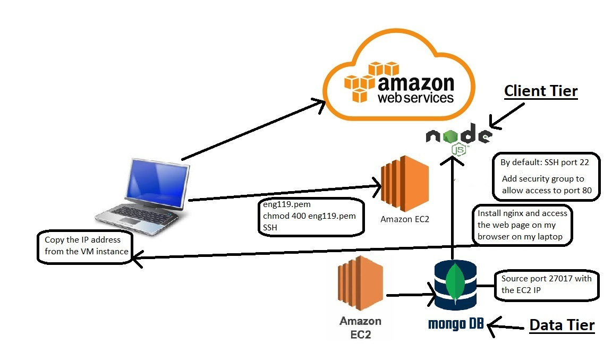

# Cloud computing with AWS

## What is cloud computing?

Cloud computing is the on-demand delivery of IT resources over the Internet with pay-as-you-go pricing. Instead of buying, owning, and maintaining physical data centers and servers, you can access technology services, such as computing power, storage, and databases, on an as-needed basis from a cloud provider like Amazon Web Services (AWS).

Cloud computing is a network of servers connected using the Internet. Its main function is to share information, resources, and software. The Internet acts as the invisible cable that connects everything. This includes all physical and virtual servers all over the globe.

Simply put, cloud computing is the delivery of computing services—including servers, storage, databases, networking, software, analytics, and intelligence—over the Internet (“the cloud”) to offer faster innovation, flexible resources, and economies of scale.

Cloud computing is the on-demand availability of computer system resources, especially data storage and computing power, without direct active management by the user. Large clouds often have functions distributed over multiple locations, each location being a data center.

## Who is using cloud computing?

Organizations of every type, size, and industry are using the cloud for a wide variety of use cases, such as data backup, disaster recovery, email, virtual desktops, software development and testing, big data analytics, and customer-facing web applications. For example, healthcare companies are using the cloud to develop more personalized treatments for patients. Financial services companies are using the cloud to power real-time fraud detection and prevention. And video game makers are using the cloud to deliver online games to millions of players around the world.

## Benefits of cloud computing

### Agility

The cloud gives you easy access to a broad range of technologies so that you can innovate faster and build nearly anything that you can imagine. You can quickly spin up resources as you need them–from infrastructure services, such as compute, storage, and databases, to Internet of Things, machine learning, data lakes and analytics, and much more.

You can deploy technology services in a matter of minutes, and get from idea to implementation several orders of magnitude faster than before. This gives you the freedom to experiment, test new ideas to differentiate customer experiences, and transform your business.

### Elasticity

With cloud computing, you don’t have to over-provision resources up front to handle peak levels of business activity in the future. Instead, you provision the amount of resources that you actually need. You can scale these resources up or down to instantly grow and shrink capacity as your business needs change.

### Cost savings

The cloud allows you to trade fixed expenses (such as data centers and physical servers) for variable expenses, and only pay for IT as you consume it. Plus, the variable expenses are much lower than what you would pay to do it yourself because of the economies of scale. 

### Deploy globally in minutes

With the cloud, you can expand to new geographic regions and deploy globally in minutes. For example, AWS has infrastructure all over the world, so you can deploy your application in multiple physical locations with just a few clicks. Putting applications in closer proximity to end users reduces latency and improves their experience. 

## Types of cloud computing

Cloud computing is providing developers and IT departments with the ability to focus on what matters most and avoid undifferentiated work like procurement, maintenance, and capacity planning. As cloud computing has grown in popularity, several different models and deployment strategies have emerged to help meet specific needs of different users. Each type of cloud service, and deployment method, provides you with different levels of control, flexibility, and management. Understanding the differences between Infrastructure as a Service, Platform as a Service, and Software as a Service, as well as what deployment strategies you can use, can help you decide what set of services is right for your needs.

## Cloud Computing Models

There are three main models for cloud computing. Each model represents a different part of the cloud computing stack.

### Infrastructure as a Service (IaaS)

Infrastructure as a Service, sometimes abbreviated as IaaS, contains the basic building blocks for cloud IT and typically provide access to networking features, computers (virtual or on dedicated hardware), and data storage space. Infrastructure as a Service provides you with the highest level of flexibility and management control over your IT resources and is most similar to existing IT resources that many IT departments and developers are familiar with today.

### Platform as a Service (PaaS)
Platforms as a service remove the need for organizations to manage the underlying infrastructure (usually hardware and operating systems) and allow you to focus on the deployment and management of your applications. This helps you be more efficient as you don’t need to worry about resource procurement, capacity planning, software maintenance, patching, or any of the other undifferentiated heavy lifting involved in running your application.

### Software as a Service (SaaS)

Software as a Service provides you with a completed product that is run and managed by the service provider. In most cases, people referring to Software as a Service are referring to end-user applications. With a SaaS offering you do not have to think about how the service is maintained or how the underlying infrastructure is managed; you only need to think about how you will use that particular piece of software. A common example of a SaaS application is web-based email where you can send and receive email without having to manage feature additions to the email product or maintaining the servers and operating systems that the email program is running on.

## Cloud Computing Deployment Models

### Cloud

A cloud-based application is fully deployed in the cloud and all parts of the application run in the cloud. Applications in the cloud have either been created in the cloud or have been migrated from an existing infrastructure to take advantage of the benefits of cloud computing. Cloud-based applications can be built on low-level infrastructure pieces or can use higher level services that provide abstraction from the management, architecting, and scaling requirements of core infrastructure.

### Hybrid

A hybrid deployment is a way to connect infrastructure and applications between cloud-based resources and existing resources that are not located in the cloud. The most common method of hybrid deployment is between the cloud and existing on-premises infrastructure to extend, and grow, an organization's infrastructure into the cloud while connecting cloud resources to internal system. For more information on how AWS can help you with your hybrid deployment, please visit our hybrid page.

### On-premises

Deploying resources on-premises, using virtualization and resource management tools, is sometimes called “private cloud”. On-premises deployment does not provide many of the benefits of cloud computing but is sometimes sought for its ability to provide dedicated resources. In most cases this deployment model is the same as legacy IT infrastructure while using application management and virtualization technologies to try and increase resource utilization.

### Examples

Pay as you go: cost effectiveness
Capex, opex: capital and operational expenditure
- A seasonal business will need flexibility to scale the use of resources as needed. When the business needs less resources it can scale back and save money on IT costs.

### AWS Global Infrastructure Map

- Normally, a company will use 3 availability zones.
- Example: Sparta Global uses London for computing resources, Ireland for databases and Frankfurt for networks.

### Cloud Models

- Public
- Private
- Hybrid

Example: the bank industry usually uses the hybrid model because they deal with highly sensitive information and they prefer to mantain control of these data. For other information that needs to have high availability they will use public services.

- Naming convention for the files that I create: eng110_sergio
- Instances should be turned off/terminated every day before 6pm (exceptionally 8pm maximum)
- Only use the Ireland region: eu-west-1/a/b/c
- AWS keys must not be shared with anyone.
- eng119.pem: move to .ssh folder in my machine

### Use of cloud services

- We have a monolith application available on premises/localhost/local data centre, that we want to deploy on cloud services.
- We create an VM instance, called EC2 in Amazon web services
- We need to SSH into the VM. For that we need a file.pem (chmod 400)
- We store the file in a .ssh folder (it is a private key)
- By default the ssh port is 22
- We have to create a security group to allow the required ports for some applications that run on especified ports (80 - 3000 for example)

### Cloud terminology

- storage: volume - EBS
- firewall: security group
- memory
- processing power

The client will give us the especifications according to 3 constrains:
- cost
- time
- power

### Steps to create a VM on AWS

- Create new EC2 instance on Ireland availability zone
- Step 1: Choose an Amazon Machine Image (AMI)
- Step 2: Choose the Ubuntu Server 18.04 LTS (HVM), SSD Volume Type Instance
- Select: Type t2.micro
- Step 3: Select: `Next: Configure Instance Details`
          Enable: `Auto-assign Public IP`
- Step 4: Add storage
- Step 5: Add tags: `Key: Name, Value: eng110_sergio`
- Step 6: Configure security group name: `eng110_sergio_sg`, description: `eng110_sergio_sg`
- Select: type: SSH, by default the port is 22, Source: MyIP
- We need to install nginx: Add rule `HTTP`, Port range: 80, Source: anywhere
- Finally: click on Review and Launch
- Select an existing key pair: `Eng119`

### How to SSH into the VM

- Download the eng119.pem file and move it to our `.shh` folder
- Click on `Connect to instance`
- Click on `SSH client`
- Copy the SSH address: `ssh -i "eng119.pem" ubuntu@ec2-18-203-127-78.eu-west-1.compute.amazonaws.com`

### How to install nginx in our VM and access the nginx welcome web page

- sudo apt update/upgrade
- sudo apt install nginx
- Copy the VM Public IP address into my browser to access the nginx welcome page
- IP: `18.203.127.78`

# Steps to install the node.js app in the VM

# 1 

- Every day the IP address changes
- I need to reselect the IP for the security group to allow it
- scp file.pem localhost/address destination/address
cp app home/ubuntu/app

scp -i ~/.ssh/eng119.pem -r ~/DevOps/devops/starter-code/app ubuntu@ec2-3-249-220-177.eu-west-1.compute.amazonaws.com:~/home/ubuntu/app

"C:\DevOps\devops\starter-code\app"
"C:\DevOps\devops\app"

rsaync also can be used
- enter new IP
- install nodejs with required dependencies

# 2
allow port 3000
cd app
npm install
nmp start

# 3
configure Nginx reverse proxy
access the app without adding port 3000

# 4
Configure Mongodb
spin up a new EC2 instance in eu-west-1 (Ireland)
create a security group to allow required ports 27017
port 22

export DB_HOST=mongodb://3.248.187.17:27017/posts

VM
ssh -i "eng119.pem" ubuntu@ec2-3-249-220-177.eu-west-1.compute.amazonaws.com
3.249.220.177

DB
ssh -i "eng119.pem" ubuntu@ec2-3-248-187-17.eu-west-1.compute.amazonaws.com
3-248-187-17

# Create 2 new instances and do everything again

1) create a EC2 instance

Auto-assign Public IP: `enable`

Security group SSH: add my IP
Add port 80, allow from anywhere

Custom TCP Rule: 27017  IP/32

VM Public IP address = 52.48.86.22
ssh -i "eng119.pem" ubuntu@ec2-52-48-86-22.eu-west-1.compute.amazonaws.com

2) Create a new instance to install the Mongo database

- create a new security group and add the VM IP address

DB = 3.249.117.186
ssh -i "eng119.pem" ubuntu@ec2-3-249-117-186.eu-west-1.compute.amazonaws.com

3) Copy the app files into the VM

- clone the repository into the VM
- install nginx `sudo apt-get install nginx`
- install nodejs 
`sudo apt install software-properties-common -y 
curl -sL https://deb.nodesource.com/setup_12.x | sudo -E bash -
sudo apt-get install nodejs -y`

- install npm
- start npm
- the app should be available on port 3000

4) Create a new EC2 instance to install Mongodb on it

5) Create a new security group for the new EC2 instance

- configure 2 rules: 

1- SSH, port 22, myIP
2- HTTP, PORT 27017 

    sudo apt-key adv --keyserver hkp://keyserver.ubuntu.com:80 --recv D68FA50FEA312927
    
    echo"deb https://repo.mongodb.org/apt/ubuntu xenial/mongodb-org/3.2 multiverse"| sudo tee /etc/apt/sources.list.d/mongodb-org-3.2.list
    
    sudo apt-get install -y mongodb-org=3.2.20 mongodb-org-server=3.2.20 mongodb-org-shell=3.2.20 mongodb-org-mongos=3.2.20 mongodb-org-tools=3.2.20

sudo systemctl mongod status active

export DB_HOST=mongodb://34.242.3.202:27017/posts

node app.js

config.sys: change to 0.0.0.0

printvar 

