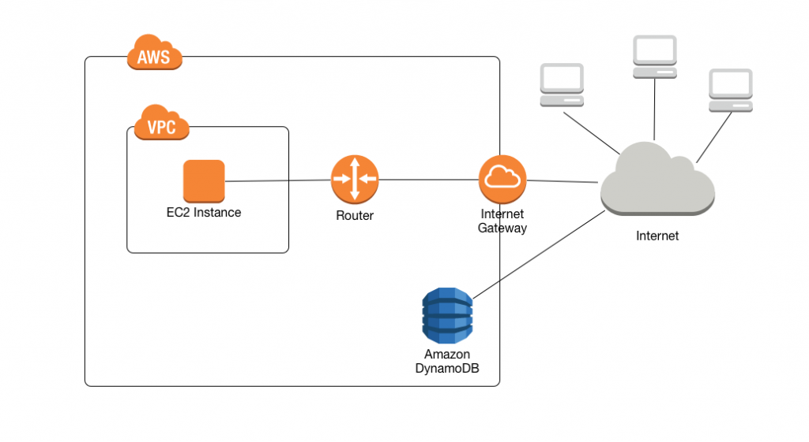
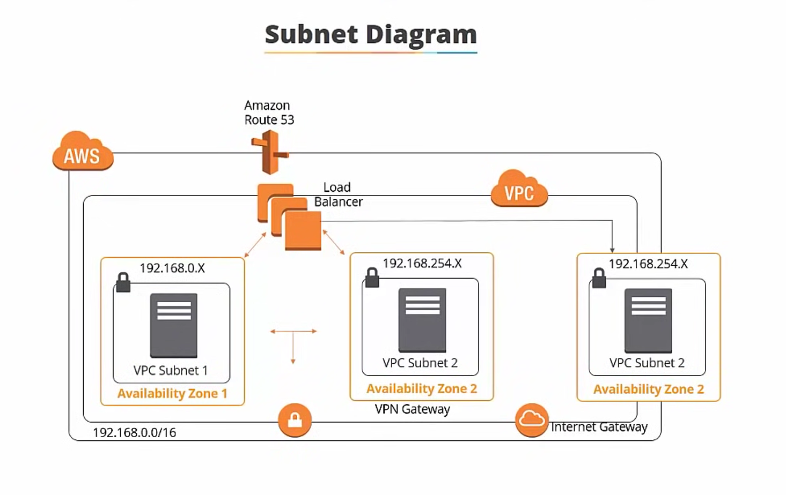
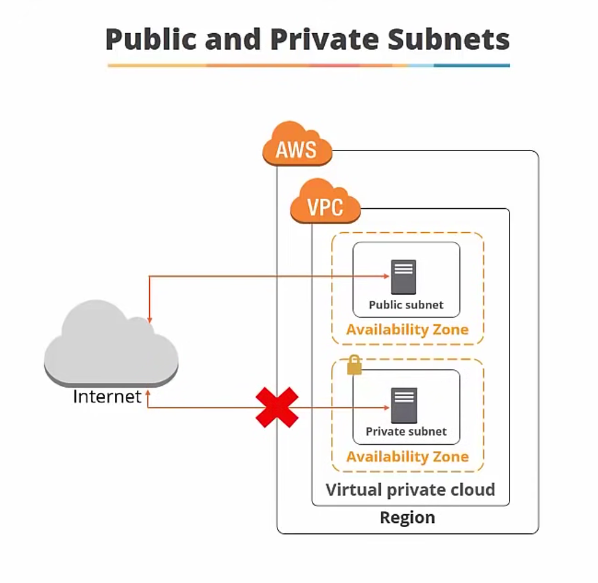
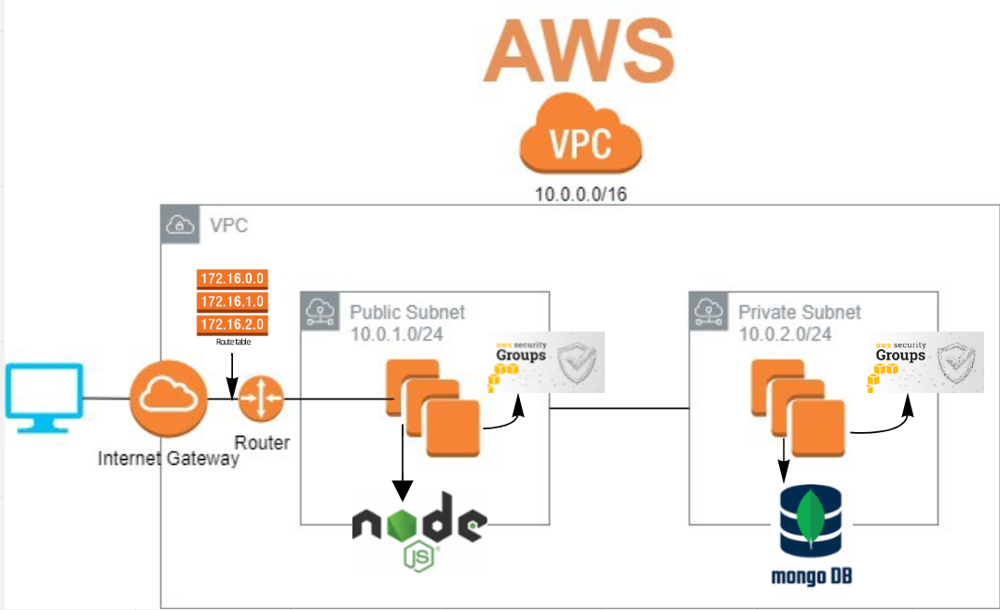

# Multi-AZ deployments for high availability

Multi-AZ deployments can have one standby or two standby DB instances. When the deployment has one standby DB instance, it's called a Multi-AZ DB instance deployment. A Multi-AZ DB instance deployment has one standby DB instance that provides failover support, but doesn't serve read traffic. 

When the deployment has two standby DB instances, it's called a Multi-AZ DB cluster deployment. A Multi-AZ DB cluster deployment has standby DB instances that provide failover support and can also serve read traffic.

You can use the AWS Management Console to determine whether a Multi-AZ deployment is a Multi-AZ DB instance deployment or a Multi-AZ DB cluster deployment. In the navigation pane, choose Databases, and then choose a DB identifier.

## Multi-AZ DB instance deployments

Amazon RDS provides high availability and failover support for DB instances using Multi-AZ deployments with a single standby DB instance. This type of deployment is called a Multi-AZ DB instance deployment. Amazon RDS uses several different technologies to provide this failover support. Multi-AZ deployments for MariaDB, MySQL, Oracle, and PostgreSQL DB instances use the Amazon failover technology. Microsoft SQL Server DB instances use SQL Server Database Mirroring (DBM) or Always On Availability Groups (AGs). For information on SQL Server version support for Multi-AZ, see Multi-AZ deployments for Amazon RDS for Microsoft SQL Server.

In a Multi-AZ DB instance deployment, Amazon RDS automatically provisions and maintains a synchronous standby replica in a different Availability Zone. The primary DB instance is synchronously replicated across Availability Zones to a standby replica to provide data redundancy and minimize latency spikes during system backups. Running a DB instance with high availability can enhance availability during planned system maintenance. It can also help protect your databases against DB instance failure and Availability Zone disruption. For more information on Availability Zones, see Regions, Availability Zones, and Local Zones.

### Failover process for Amazon RDS

If a planned or unplanned outage of your DB instance results from an infrastructure defect, Amazon RDS automatically switches to a standby replica in another Availability Zone if you have turned on Multi-AZ. The time that it takes for the failover to complete depends on the database activity and other conditions at the time the primary DB instance became unavailable. Failover times are typically 60–120 seconds. However, large transactions or a lengthy recovery process can increase failover time. When the failover is complete, it can take additional time for the RDS console to reflect the new Availability Zone.

## Multi-AZ DB cluster deployments

A Multi-AZ DB cluster deployment is a high availability deployment mode of Amazon RDS with two readable standby DB instances. A Multi-AZ DB cluster has a writer DB instance and two reader DB instances in three separate Availability Zones in the same AWS Region. Multi-AZ DB clusters provide high availability, increased capacity for read workloads, and lower write latency when compared to Multi-AZ DB instance deployments.

### Overview of Multi-AZ DB clusters

With a Multi-AZ DB cluster, Amazon RDS replicates data from the writer DB instance to both of the reader DB instances using the DB engine's native replication capabilities. When a change is made on the writer DB instance, it's sent to each reader DB instance. Acknowledgment from at least one reader DB instance is required for a change to be committed.

Reader DB instances act as automatic failover targets and also serve read traffic to increase application read throughput. If an outage occurs on your writer DB instance, RDS manages failover to one of the reader DB instances. RDS does this based on which reader DB instance has the most recent change record.

scaling out = more servers
scaling up/down = size

autoscaling policy = autoscaling group

# What is an Application Load Balancer?

Elastic Load Balancing automatically distributes your incoming traffic across multiple targets, such as EC2 instances, containers, and IP addresses, in one or more Availability Zones. It monitors the health of its registered targets, and routes traffic only to the healthy targets. Elastic Load Balancing scales your load balancer as your incoming traffic changes over time. It can automatically scale to the vast majority of workloads.

## Application Load Balancer components

A load balancer serves as the single point of contact for clients. The load balancer distributes incoming application traffic across multiple targets, such as EC2 instances, in multiple Availability Zones. This increases the availability of your application. You add one or more listeners to your load balancer.

A listener checks for connection requests from clients, using the protocol and port that you configure. The rules that you define for a listener determine how the load balancer routes requests to its registered targets. Each rule consists of a priority, one or more actions, and one or more conditions. When the conditions for a rule are met, then its actions are performed. You must define a default rule for each listener, and you can optionally define additional rules.

Each target group routes requests to one or more registered targets, such as EC2 instances, using the protocol and port number that you specify. You can register a target with multiple target groups. You can configure health checks on a per target group basis. Health checks are performed on all targets registered to a target group that is specified in a listener rule for your load balancer.

# Launch templates

1) create launch template

- Tag convention: eng110-sergio
- Add tag: Name
- Key pair name: eng_119
- Network settings: select existing: eng110_sergio_sg

## Auto scaling group

## Monitoring service for AWS resources: EC2 autoscaling group

Alert management: notification service

SQS Simple Queue Service

Metrics: we can put them on a dashboard

# What is Elastic Load Balancing?

Elastic Load Balancing automatically distributes your incoming traffic across multiple targets, such as EC2 instances, containers, and IP addresses, in one or more Availability Zones. It monitors the health of its registered targets, and routes traffic only to the healthy targets. Elastic Load Balancing scales your load balancer as your incoming traffic changes over time. It can automatically scale to the vast majority of workloads.

## Load balancer benefits

A load balancer distributes workloads across multiple compute resources, such as virtual servers. Using a load balancer increases the availability and fault tolerance of your applications.

You can add and remove compute resources from your load balancer as your needs change, without disrupting the overall flow of requests to your applications.

You can configure health checks, which monitor the health of the compute resources, so that the load balancer sends requests only to the healthy ones. You can also offload the work of encryption and decryption to your load balancer so that your compute resources can focus on their main work.

## Features of Elastic Load Balancing

Elastic Load Balancing supports the following load balancers: Application Load Balancers, Network Load Balancers, Gateway Load Balancers, and Classic Load Balancers. You can select the type of load balancer that best suits your needs.

# Networking – VPC architecture

Amazon Virtual Private Cloud (VPC) is a commercial cloud computing service that provides users a virtual private cloud, by "provisioning a logically isolated section of Amazon Web Services (AWS) Cloud". Enterprise customers are able to access the Amazon Elastic Compute Cloud (EC2) over an IPsec based virtual private network. Unlike traditional EC2 instances which are allocated internal and external IP numbers by Amazon, the customer can assign IP numbers of their choosing from one or more subnets. By giving the user the option of selecting which AWS resources are public facing and which are not, VPC provides much more granular control over security. For Amazon it is "an endorsement of the hybrid approach, but it's also meant to combat the growing interest in private clouds".

# What is a VPC and a service attached to VPC

## What is Amazon VPC?

Amazon Virtual Private Cloud (Amazon VPC) enables you to launch AWS resources into a virtual network that you've defined. This virtual network closely resembles a traditional network that you'd operate in your own data center, with the benefits of using the scalable infrastructure of AWS.

### VPCs and subnets

A virtual private cloud (VPC) is a virtual network dedicated to your AWS account. It is logically isolated from other virtual networks in the AWS Cloud. You can launch your AWS resources, such as Amazon EC2 instances, into your VPC. You can specify an IP address range for the VPC, add subnets, associate security groups, and configure route tables.

A subnet is a range of IP addresses in your VPC. You can launch AWS resources into a specified subnet. Use a public subnet for resources that must be connected to the internet, and a private subnet for resources that won't be connected to the internet.

## 1) internet gateway

Connect to the internet using an internet gateway
An internet gateway is a horizontally scaled, redundant, and highly available VPC component that allows communication between your VPC and the internet. An internet gateway enables resources (like EC2 instances) in your public subnets to connect to the internet if the resource has a public IPv4 address or an IPv6 address. Similarly, resources on the internet can initiate a connection to resources in your subnet using the public IPv4 address or IPv6 address. For example, an internet gateway enables you to connect to an EC2 instance in AWS using your local computer.

An internet gateway serves two purposes: to provide a target in your VPC route tables for internet-routable traffic, and to perform network address translation (NAT) for instances that have been assigned public IPv4 addresses. For more information, see Enable internet access.

An internet gateway supports IPv4 and IPv6 traffic. It does not cause availability risks or bandwidth constraints on your network traffic. There's no additional charge for having an internet gateway in your account.

-Enable internet access

To enable access to or from the internet for instances in a subnet in a VPC, you must do the following.
•	Create an internet gateway and attach it to your VPC.
•	Add a route to your subnet's route table that directs internet-bound traffic to the internet gateway.
•	Ensure that instances in your subnet have a globally unique IP address (public IPv4 address, Elastic IP address, or IPv6 address).
•	Ensure that your network access control lists and security group rules allow the relevant traffic to flow to and from your instance.

### Public and private subnets

If a subnet is associated with a route table that has a route to an internet gateway, it's known as a public subnet. If a subnet is associated with a route table that does not have a route to an internet gateway, it's known as a private subnet.
In your public subnet's route table, you can specify a route for the internet gateway to all destinations not explicitly known to the route table (0.0.0.0/0 for IPv4 or ::/0 for IPv6). Alternatively, you can scope the route to a narrower range of IP addresses; for example, the public IPv4 addresses of your company’s public endpoints outside of AWS, or the Elastic IP addresses of other Amazon EC2 instances outside your VPC.

## 2) routing table

A route table contains a set of rules, called routes, that determine where network traffic from your subnet or gateway is directed.

Subnet route tables
Your VPC has an implicit router, and you use route tables to control where network traffic is directed. Each subnet in your VPC must be associated with a route table, which controls the routing for the subnet (subnet route table). You can explicitly associate a subnet with a particular route table. Otherwise, the subnet is implicitly associated with the main route table. A subnet can only be associated with one route table at a time, but you can associate multiple subnets with the same subnet route table.

## 3) what is a subnet

 subnet is a range of IP addresses in your VPC. You can launch AWS resources into a specified subnet. Use a public subnet for resources that must be connected to the internet, and a private subnet for resources that won't be connected to the internet.

To protect the AWS resources in each subnet, you can use multiple layers of security, including security groups and network access control lists (ACL).

You can launch AWS resources, such as EC2 instances, into a specific subnet. When you create a subnet, you specify the IPv4 CIDR block for the subnet, which is a subset of the VPC CIDR block. Each subnet must reside entirely within one Availability Zone and cannot span zones. By launching instances in separate Availability Zones, you can protect your applications from the failure of a single zone.

## 4) what is CIDR block

CIDR blocks are groups of addresses that share the same prefix and contain the same number of bits. The combination of multiple connecting CIDR blocks into a larger whole, sharing a common network prefix, is what constitutes supernetting. The size of CIDR blocks can be determined by the length of the prefix.

The CIDR block is a fixed prefix length of /56. You can request an IPv6 CIDR block from Amazon's pool of IPv6 addresses. If you've associated an IPv6 CIDR block with your VPC, you can associate an IPv6 CIDR block with an existing subnet in your VPC, or when you create a new subnet.

## 5) sub-mask

Each network, by default, has only one subnet, which contains all of the host addresses defined within. A netmask is basically a specification of the amount of address bits that are used for the network portion. A subnet mask is another netmask within used to further divide the network.
A subnet mask is used to divide an IP address into two parts. One part identifies the host (computer), the other part identifies the network to which it belongs

## 6) IP-networking

Short description. An Elastic IP address is a static public IPv4 address associated with your AWS account in a specific Region. Unlike an auto-assigned public IP address, an Elastic IP address is preserved after you stop and start your instance in a virtual private cloud (VPC)

## 7) NACL

A network access control list (ACL) is an (extra) optional layer of security that acts as a firewall for controlling traffic in and out of a subnet. You might set up network ACLs with rules similar to your security groups in order to add an additional layer of security to your VPC. You can associate multiple subnets with a single network ACL, but a subnet can be associated with only one network ACL at a time.

Example of tickets to access an stadium, or a cinema exhibiting many film

with an NACL I have to define an exit rule (in and out)

we must define outbound rules for NACL, in the security group we only define inbound rules.

a subnet can have many EC2 instances (servers)

Stateful firewalls are capable of monitoring and detecting states of all traffic on a network to track and defend based on traffic patterns and flows. Stateless firewalls, however, only focus on individual packets, using preset rules to filter traffic.

The Stateful protocol design makes the design of server very complex and heavy. Stateless Protocols works better at the time of crash because there is no state that must be restored, a failed server can simply restart after a crash.

Stateless Protocol is a network protocol in which Client send request to the server and server response back as per the given state. Stateful Protocol is a network protocol in which if client send a request to the server then it expects some kind of response, in case of no response then it resend the request.

# AWS Virtual Private Cloud Architecture (VPC)

1) Create VPC (Virtual Private Cloud)

eng110-sergio-vpc
VPC only
IPv4 CIDR
provide CIDR: 10.0.1.0/16

TAG again: eng110-sergio-vpc

2) create gateway

eng110-sergio-ig

3) attach gateway to VPC

we need to provide the VPC address to the gateway

- select the Internet gateway
- click on Actions: Attach to VPC
- select my VPC

4) create subnet

select the VCP ID
eng110-sergio-sb-public

- Availability Zone: no preference
- IPv4 CIDR block: 10.0.1.0/24
- tag

5) create route table

eng110-sergio-rt-public

-select my VPC: eng110-sergio-vpc 
- tag

At this point, this route table only knows which VPC to connect with, but doesn't know to which subnet

6) Edit route table: Routes

We need to connect it to the gateway, to let the external traffic to come in

Edit routes: add another rule

- Destination: 0.0.0.0/0 (anyone)
- Target: internet gateway (when I select it my gateway will pop out)

7) Edit route table: Subnet associations

Now we need to link the subnet with the route table

- Click on: Edit subnet associations
- Under available subnets, select mine
- Save associations 

8) Now we have to test if everything is OK

- Launch instance from AMI

eng110-sergio-vpc-testing-app

## Create a Private Subnet for the data client (MongoDb) 

1) create subnet

select the VPC ID
eng110-sergio-sb-private

- Availability Zone: no preference
- IPv4 CIDR block: 10.0.2.0/24
- tag

Now the private subnet is ready, I will create an EC2 from the AMI with the data tier (MongoDB)

2) Launch instance from AMI (MongoDB)

- Tag:

- Select my VPC: ENG110-sergio-vpc

- Auto-assign Public IP: enable

2) Create a security group for the EC2

Tag: eng110-sergio-vpc-testing-data

3) Update the environment variable in the app instance

db ip: 10.0.0.96

sudo echo "export DB_HOST=mongodb://10.0.0.96:27017/posts" >> ~/.bashrc
source ~/.bashrc
printenv DB_HOST

we need to install updates in the MongoDB

it can be done by multiple services, use the one that works for us (NAT device)

security group for private subnet* and the instance : create a rule custom tcp allow all and put the CDR block of public subnet

allow the ec2 instance from the public subnet to send a request

run npm in the backgroud

